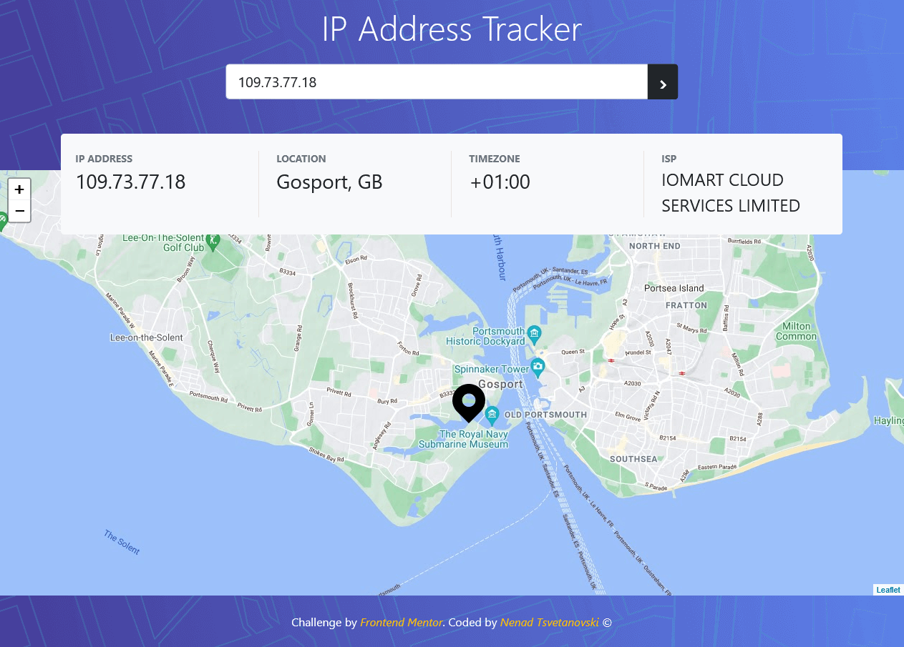
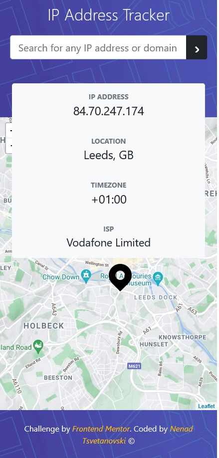
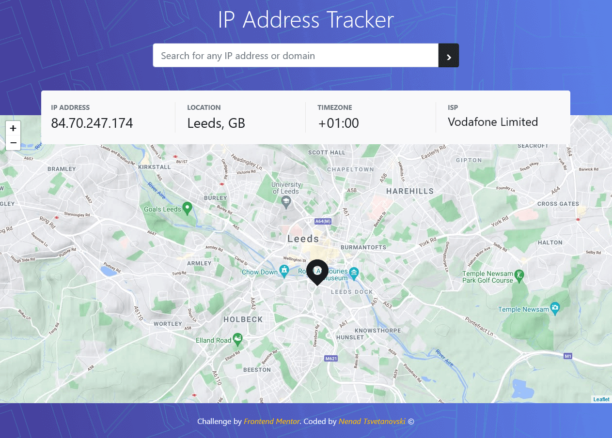

# IP address tracker 

## Table of contents

- [Overview](#overview)
  - [The challenge](#the-challenge)
  - [Screenshot](#screenshot)
  - [Links](#links)
- [My process](#my-process)
  - [Built with](#built-with)
- [Author](#author)

## Overview

Users should be able to:

- View the optimal layout for each page depending on their device's screen size
- See hover states for all interactive elements on the page
- See their own IP address on the map on the initial page load
- Search for any IP addresses or domains and see the key information and location

### Screenshot

### Links

- GitHub URL: https://github.com/Nesh00/ip-tracker-app
- Live Site URL: [https://ip-tracker-nenad.netlify.app/]

## My process

### Built with

- Semantic HTML5 markup
- CSS custom properties
- Bootstrap 5
- JavaScript
- Leaflet
- Ipify

## Author

- LinkedIn - [https://www.linkedin.com/in/nenad-tsvetanovski-3101b474/]
- Twitter - [https://twitter.com/nenad37452460]
